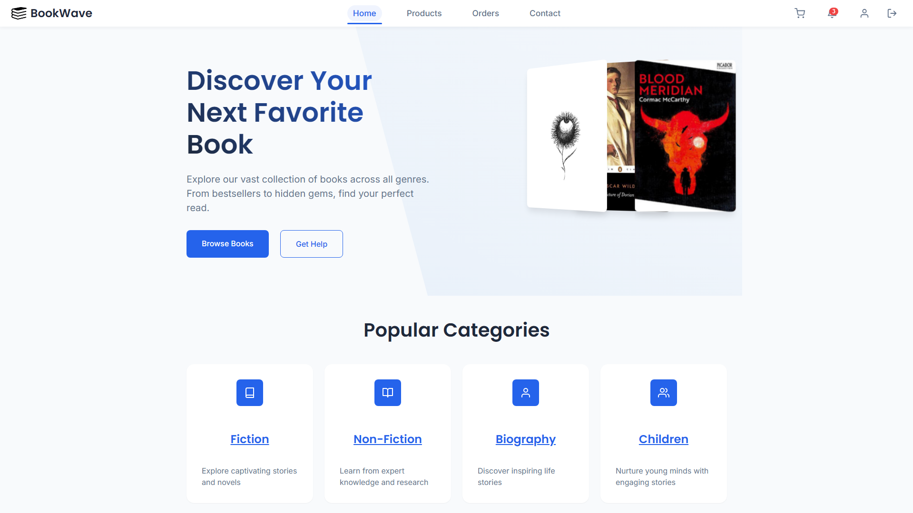

# BookWave

Advanced Software Development - Group 9  
Online Bookstore System

## Project Screenshot



**GitHub Repository**: https://github.com/nixonboros/bookwave-web-app

## Team Member Responsibilities

- **Jerry**
  - **Release 0 & 1:**
  - Cleaned up index.jsp (added Best Sellers section)
  - Login/Register
  - User Dashboard (Edit and view account details, delete account) 
  - Page Footer
  - General data validation
  - Helped with catalogue features (add book, delete book, display book(s) in catalogue and best sellers in index.jsp, individual product pages and Manage Catalogue menu (staff))
  - Helped setup database
  - Set up testing and linked to Azure
  - UserTest test class (Testing: creating, updating and deleting of users in database)
  - BookTest test class (Testing: creating and deleting of books in database)

  - **Release 2:**
  - Started Cart and Orders (Adding items to cart, initial checkout page)
  - Added staff details (viewing, editing and deleting personal staff account)
  - User and Staff Management (Batch Delete, search function, edit pages)

- **Nixon**
  - **Release 0 & 1:**
  - Customer Support Feature (user/staff support chat, viewing and opening/closing tickets)
  - Notifications dropdown menu
  - Tomcat server setup 
  - Database setup (tables and contents)
  - General data validation
  - Helped with User/Staff login and registration
  - User/Staff page navigation bar
  - SupportTicketTest test class (Testing: creating, retrieving and adding messages to support tickets in database)

  - **Release 2:**
  - Notification Feature (user notification dashboard, mark all as read functionality, staff adding messages or opening/closing support tickets sends notifications to user)
  - Helped with Order feature (user side)
  - Refining Customer Support Feature (ordering of tickets in dashboard - recent shows up at top)

## Setup Instructions

### 1. Install NetBeans
- Install **NetBeans 23** (latest version).

### 2. Open Project
- Open the **online-bookstore-app** project directory

### 3. Set Up Tomcat Server
- Download the Tomcat server zip file: [Tomcat Server](https://dlcdn.apache.org/tomcat/tomcat-11/v11.0.0-M26/bin/apache-tomcat-11.0.0-M26-windows-x64.zip)
- Inside NetBeans, go to the **Services** tab > **Add Server** > Choose **Tomcat** and select the directory to the Tomcat server folder. Use:
  - **Username**: admin
  - **Password**: admin
- After adding the Tomcat server, go to the **Projects** tab > Right-click **online-bookstore-app** > **Properties** > **Run** > Change the server to **Tomcat**.

### 4. Set Up Database
- Download MySQL: [MySQL Download](https://dev.mysql.com/downloads/file/?id=532677) (server only).
- Download MySQL Connector: [MySQL Connector](https://downloads.mysql.com/archives/get/p/3/file/mysql-connector-j-8.0.32.zip)
- Go to the **Services** tab > Right-click **Databases** > **New Connection** > Choose **MySQL** > Add > Select the `mysql-connector-j-8.0.32.jar` file > Enter **Password**: root.
- Start the MySQL server > Right-click > Create database > Name it **`bookstoredb`** exactly.

## Repository Structure

The repository is organized as follows:
```
bookwave-web-app
├── online-bookstore-app
│   ├── src
│   │   ├── main
│   │   │   ├── webapp                   # Contains all web-related files
│   │   │   │   ├── css                  # Stylesheets for the application
│   │   │   │   ├── images               # Images used in the application
│   │   │   └── java                     # Contains Java source code
│   │   │       └── com
│   │   │           └── g3app
│   │   │               ├── controller   # Servlet and controller classes
│   │   │               ├── dao          # Data Access Objects
│   │   │               └── model        # Model classes representing data
│   │   └── test                         # Contains test classes
│   ├── target                           # Compiled output and artifacts
│   └── pom.xml                          # Maven Project Object Model file
├── azure-pipelines.yml                  # Configuration for Azure DevOps pipeline
└── README.md                            # Documentation file for the project
```

### Explanation of the Structure

- **bookwave-web-app**: The root folder of the project containing all necessary files and folders.
- **online-bookstore-app**: The main application directory that contains the source code and resources for the online bookstore system.
  - **src**: Contains the source code for the application.
    - **main**: Main source set where the application code resides.
      - **webapp**: This folder holds all web-related files such as JSP files, stylesheets (CSS), and images.
      - **java**: Contains Java source code organized under the package `com.g3app`, which includes:
        - **controller**: Contains servlet and controller classes that handle requests and responses.
        - **dao**: Contains Data Access Object classes that interact with the database.
        - **model**: Contains model classes that represent the application's data structures.
    - **test**: Contains test classes for the application to ensure the functionality of various components.
  - **target**: Directory where compiled output and artifacts from the build process are stored.
  - **pom.xml**: The Maven Project Object Model (POM) file, which defines project dependencies, build configurations, and other project settings.
- **azure-pipelines.yml**: A configuration file for setting up continuous integration and deployment using Azure DevOps.
- **README.md**: A documentation file that provides an overview of the project, setup instructions, and other relevant information.
